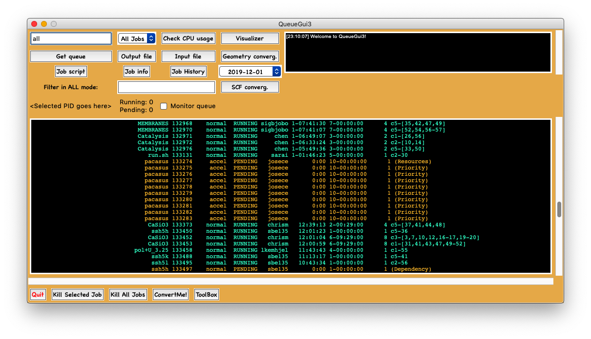

# QueueGui: A simple GUI for SLURM

#### This application provides a simple graphical user interface to looking at your SLURM queue. 



## Features:

- Secure log-in to remote cluster by SSH
- Should work on MacOS, Windows, and Linux
- Color coding of jobs based on current status
- Filter content based on status or keywords
- Securely kill single jobs, all jobs, or job ranges
- List the CPU usage on the cluster, so that you know who to blame!
- Look at input and output files at the click of a button
- Look at your job history in color code. You decide how far back you want to go.
- Comes with output file parsers for Gaussian16, ORCA 4.1.2, and MRChem 2.0
- Plot SCF convergence of MRChem jobs, and geometry convergence of Gaussian/ORCA jobs
- Open output files with your favorite visualizer
- The ToolBox comes with additional features:
  - Extract optimized geometries
  - Randomly displace coordinates (you set the scale factor)
  - Displace coordinates as defined by a normal mode (usually imaginary)
  - Extract normal mode information from ORCA .hess file for easy visualization in Molden
- Easily convert between .xyz and Gaussian input formats
- Keyboard shortcuts
- Notification at startup when new version is available on Github
- Easily convert XYZ files between Angström and Bohr
- Customize by setting colors and fonts!

## Installation

1. Download the git repository to your location of choice.

2. In order to set your own preferences, QueueGui expects a file called `settings.json` to be located in `~/.QueueGui`. You need to create this file (it can be empty). On MacOS you can run in the terminal

    ```bash
    mkdir $HOME/.QueueGui
    touch $HOME/.QueueGui/settings.json
    ```

3. You will probably need to install some dependencies. No automatic way of doing this exists at this time, so you should just try to run the application and look at the errors you get. Then use `pip`to install the latest versions. 

4. To run the application, navigate in your terminal to the directory `QueueGui/queuegui` in the project you downloaded from Github. To run the application, run in your terminal the following:

   ```bash
   python3 queuegui.py
   ```

## Requirements

- Python3 (developed with version 3.8, but other 3.x versions are also likely to work)

- `paramiko` for establishing SSH and SFTP connections

- `tkinter` for the GUI

- `matplotlib` for plotting

- `json` for reading/writing settings to file

- `tempfile` for making temporary directories that store files downloaded from the remote cluster

- `requests` for sending HTTP requests to Github when checking for updates

  

## User Manual

The features can be diveded into two categories: 1) job independent commands that require no input, 
and 2) job dependent commands that require the PID of one of your running or pending jobs. 
Job independent commands should 
work out-of-the-box when you download QueueGui, but job dependent commands may need some tweeking in 
the Preferences window (more on that below).

### Job independent commands
Below is a list of the job independent commands. Just click on their respective buttons, and the output
should be displayed in the main window
- Get queue
- Job History
- Check CPU usage
- The filter functionalities


### Job dependent commands
Below is a list of the job dependent commands. All these commands take the job PID as input. Just select the PID
with the mouse, either by double-clicking on the PID or by clicking-and-dragging over the PID. If done correctly,
the selected PID should be visible in a text label in the main window.
- Output file
- Input file
- Job script
- Job info
- Kill Selected Job
- Kill All Jobs
- Kill job range
- Plot SCF convergence
- Plot geometry convergence
- Open output in visualizer
- Functions in the ToolBox:
    - Get optimized geometry
    - Get ORCA normal modes
    - Apply normal mode
    - Random displacements
- Functions in ConvertMe:
    - .xyz -> .com
    - .com -> .xyz
    - Bohr -> Angström
    - Angström -> Bohr