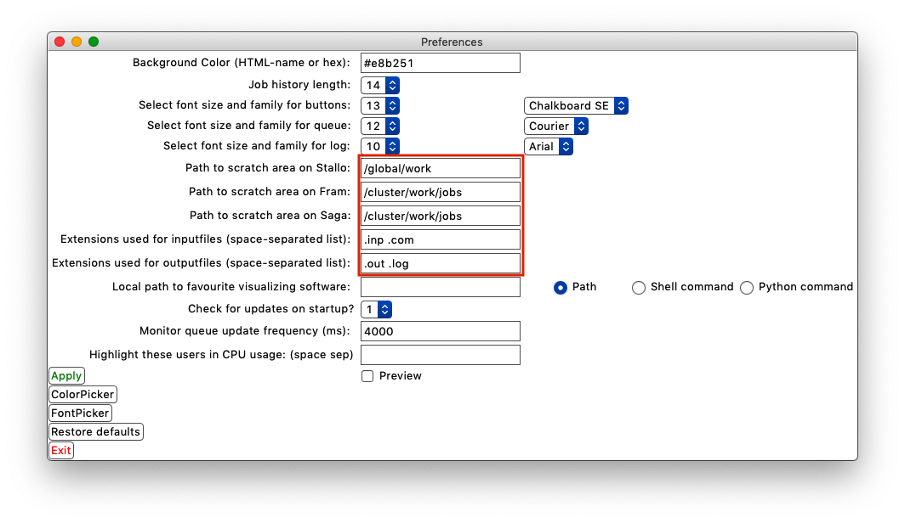

# QueueGui: A simple GUI for SLURM

#### This application provides a simple graphical user interface to looking at your SLURM queue. 


## Features:

- Secure log-in to remote cluster by SSH
- Should work on MacOS, Windows, and Linux
- Color coding of jobs based on current status
- Filter content based on status or keywords
- Securely kill single jobs, all jobs, or job ranges
- List the CPU usage on the cluster, so that you know who to blame!
- Look at input and output files at the click of a button
- Look at your job history in color code. You decide how far back you want to go.
- Comes with output file parsers for Gaussian16, ORCA 4.1.2, and MRChem 2.0
- Plot SCF convergence of MRChem jobs, and geometry convergence of Gaussian/ORCA jobs
- Open output files with your favorite visualizer
- The ToolBox comes with additional features:
  - Extract optimized geometries
  - Randomly displace coordinates (you set the scale factor)
  - Displace coordinates as defined by a normal mode (usually imaginary)
  - Extract normal mode information from ORCA .hess file for easy visualization in Molden
- Easily convert between .xyz and Gaussian input formats
- Keyboard shortcuts
- Notification at startup when new version is available on Github
- Easily convert XYZ files between Angström and Bohr
- Customize by setting colors and fonts!

## Installation

1. Download (or clone) the git repository to your location of choice.

2. Install `requirements.txt` in your standard Python library (or set up virtual environment first, and then install). More on this below.

3. To run the application, navigate your terminal to the directory `QueueGui/queuegui` in the project you downloaded from Github. To run the application, run in your terminal the following:

   ```bash
   python queuegui.py
   ```

4. At your first startup, you will be prompted to make the directory `~/QueueGui3`. QueueGui will store your personalized settings file (`settings.json`) here (and possibly other files in future versions). If you click "No", you will not be able to write your settings to file, and you will always use the default settings (which will inhibit certain functions).

## Requirements
QueueGui has been developed for Python 3.8, but older 3.x version may also work (but has not been tested).
To get the necessary dependencies, just install the `requirements.txt`:

```bash
pip install -r requirements.txt
```
You may want to set up a virtual environment if you don't want to install the modules globally in your default Python library.

  

## User Manual

The features can be diveded into two categories: 1) job independent commands that require no input, 
and 2) job dependent commands that require the PID of one of your running or pending jobs. 
Job independent commands should 
work out-of-the-box when you download QueueGui, but job dependent commands may need some tweeking in 
the Preferences window (more on that below).

### Job independent commands
Below is a list of the job independent commands. Just click on their respective buttons, and the output
should be displayed in the main window
- Get queue
- Job History
- Check CPU usage
- The filter functionalities

### Job dependent commands
Below is a list of the job dependent commands. All these commands take the job PID as input. Just select the PID
with the mouse, either by double-clicking on the PID or by clicking-and-dragging over the PID. If done correctly,
the selected PID should be visible in a text label in the main window.
- Output file
- Input file
- Job script
- Job info
- Kill Selected Job
- Kill All Jobs
- Kill job range
- Plot SCF convergence
- Plot geometry convergence
- Open output in visualizer
- Functions in the ToolBox:
    - Get optimized geometry
    - Get ORCA normal modes
    - Apply normal mode
    - Random displacements
- Functions in ConvertMe:
    - .xyz -> .com
    - .com -> .xyz
    - Bohr -> Angström
    - Angström -> Bohr
    
### Setting up your preferences
The Preferences window looks like this:



In order to save your settings for the next time you open QueueGui, you need to create a settings file
(as described under Installation).
In order to open input and output files, you also need to specify the path to your scratch area.
These paths for Stallo, Fram, and Saga can be set by opening the Preferences window: press `ctrl+p` or navigate to
`System -> Preferences` in the top menu bar.

QueueGui assumes that the scratch directory for a given job **ends with the PID**. This is the default on Fram/Saga, 
but may not be the case on Stallo, depending on how you submit your jobs. Also modify the extensions you use
for your input and output files in the preferences in a space-separated list of extensions (including the ".").
Click "Apply" in order to write your new settings to file.

Use FontPicker to get a preview of all available fonts. Click on a font, and then decide which part of QueueGui
you want that font to be applied to.
Use ColorPicker to get a color map, and click on a color to update the background color of the application.

If the "Preview" button is checked, then the settings file is not overwritten when you click "Apply". It is a way to
test your settings without changing the settings file.
